## Funding an Auditorium {auto-animate=true}

{fig-align="center"}

::: {.notes}
Suppose we're opening a new university institute, and we're looking for a sponsor for our new auditorium.
:::

## Funding an Auditorium {auto-animate=true}

$\ $

{fig-align="center"}

$\ $

**Posted-price:** "Announce a price and choose any sponsor willing to pay the price."

. . .

**First-price auction:** "Invite all sponsors to submit a sealed bid. The highest bidder wins and pays their bid."

. . .

**Second-price auction:** "Invite all sponsors to submit a sealed bid. The highest bidders wins and pays the second-highest bid."

. . .

**Revenue Equivalence Theorem:** first- and second-price auctions raise same amount of money.

::: {.notes}
A simple strategy is to contact potential sponsors with a fixed price---say £100,000---and choose any one of the sponsors who've agreed to this price. 

This mechanism works. But do we really want to limit ourselves to a fixed price? We could extract more sponsorship money by asking all potential sponsors how much they're like to donate. The highest bidder then "wins" the sponsorship and donates the amount they've bid. This is known as a first-price auction.

But the first-price auction has a disadvantage: bidders typically "shade" their bid by submitting less than their true value. The amount of shading depends on their beliefs of the other bidders in the auction. This strategic behaviour is not ideal because it makes things more complicated.

Luckily, we can modify our auction slightly to eliminate strategic behaviour: instead of paying their own bid, the highest bidder is asked to pay the second-highest bid. With this small tweak, the potential sponsors are best off simply bidding their true value. So a slightly more complicated rule can still make it much easier for bidders to participate.

And a deep result in mechanism design---the revenue equivalence theorem---tells us that both auctions end up raising the same amount of money, which is reassuring.
:::

## Mechanism Design

> "The theory of mechanism design can be thought of as the engineering side of economic theory."
 
--- Eric Maskin

. . .

#### Design Objectives

::: {.item-container}
* **Efficiency**
    Maximize welfare
* **Optimality**
    Maximise seller revenue
* **Stability**
    No deviations
* **Individual rationality**
    Voluntary participation
* **Incentive compatibility**
    Truth-telling optimal
* **Fairness**
    Fair outcomes
:::

... and many more.

::: {.notes}
I find this quote very useful to introduce MD: [...]

While much of economics deals with *understanding* markets in the real world, mechanism design *creates*, or *engineers*, mechanisms to achieve desirable properties. 

These desiderata are highly dependent on the problem at hand. But when designing mechanisms, we often care about: ...
:::

## Success Stories
<!-- {background-color="aquamarine"} -->

:::: {.columns}

::: {.column}

  💰

- Ad auctions
- Spectrum auctions
- Central Banking & Finance
- Cryptocurrencies & Blockchain
:::

::: {.column}

  💰
  ❌

- Paired kidney donation
- School choice mechanisms
- National Resident Matching Program
- Course allocation
:::

::: {.notes}
Over the last decades, MD has made a tremendous impact on society and the economy. And instead of giving you an mathematical introduction to MD, I thought I'd start by telling you about a few celebrated success stories.

MD has fundamentally influenced the internet economy, including digital advertising. It is also central to the allocation of telecommunication spectrum, and underpins mechanisms in central banking and finance.

These are all examples of mechanisms involving money. But sometimes, it's undesirable or even illegal to involve money in mechanisms. This includes applications like organ donation, school choice or course allocation mechanisms, and the allocation of medical students to residencies.
:::

::::

## Ad Auctions
* Ad auctions drives USD 600+ billion in advertising revenue per year

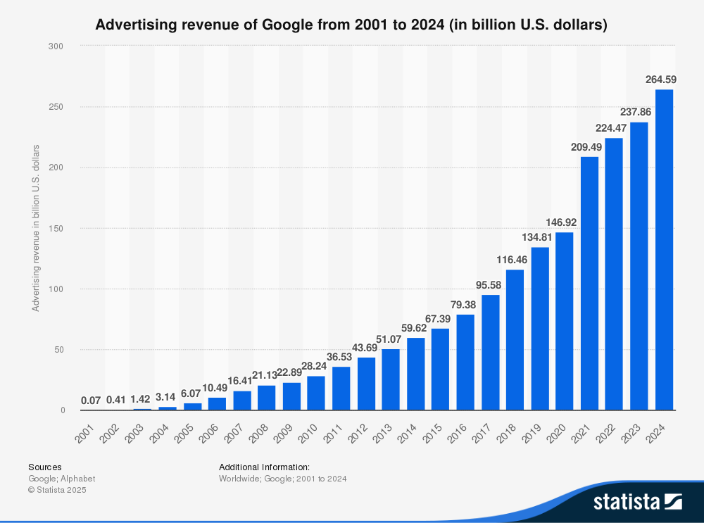{width="80%" fig-align="center"}

* Primary objective: revenue (subject to long-term advertiser happiness)
* Companies employ teams of mechanism design experts

::: {.notes}
The internet as we know it wouldn't exist without digital ads. The online ad market is worth a staggering 600+ billion USD.

Here, for example, you can see that Google alone made over USD 200b last year.

Google switched from second-price to first-price auctions in 2020-2021, partly because of the simpler payment rule. Does this explain the revenue jump?

As the graph suggests, the primary objective in these auctions is revenue maximisation. But Google is competing with other tech companies, so their ad mechanism also needs to ensure long-term engagement.

A significant concern when designing ad auctions, then, the experience of advertisers. Platforms are designed to be intuitive and remove "friction" from the ad buying process.
:::

## Spectrum Auctions

::: {layout-ncol=2}
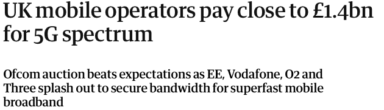{width=100%}

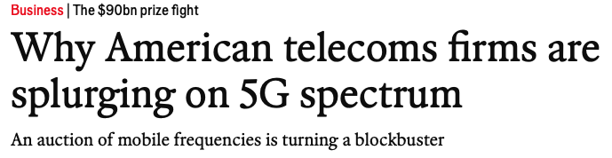{width=100%}
:::

* Typically run as simultaneous ascending multi-round auctions (SMRAs).
* EU countries are legally obliged to prioritise welfare (efficiency) over revenue.
* Can lead to highly strategic behaviour (collusion, bid signalling, aggressive bidding).

::: {.notes}
Mobile telecommunication networks are crucial to modern life and the economy, so it's important that spectrum is allocated efficiently to telecoms.

Spectrum auctions are now the default mechanism for allocating spectrum to telecom. 

These auctions can take many different forms, but are usually run in the form of ascending-price auctions where the bidders can bid on different bundles of spectrum.

* Typically raise significant amounts of money, but primary objective for the auctioneer should be downstream efficiency.

The precise design of these auctions is as much an art as a science. Spectrum auctions are typically highly strategic, with agents using a multitude of techniques to achieve their aims.
:::

## Liquidity in Banking Systems
After 2007-8 financial crisis, the Bank of England needed a mechanism to provide liquidity to financial institutions.

:::: {.columns}

::: {.column width=70%}
* The **Product-Mix Auction** was developed in 2007-8 by Paul Klemperer for the BoE.
* Currently run weekly to provide loans of funds to financial institutions.
* Bidders use intuitive "bidding language".
* The BoE can adapt supply to meet increased demand caused by liquidity stress.
:::
::: {.column width=30%}
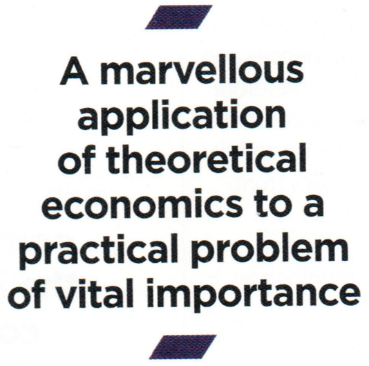{width=80%}
:::
::::

::: aside
Paul Klemperer has also advised the Banco de México on related auction mechanisms.
:::

::: {.notes}
After the financial crisis of 2007-8 the Bank of England approached Paul Klemperer, an economist at Oxford, because they needed a new mechanism to provide liquidity to financial institutions.

The PMA is an auction to simultaneously allocate multiple goods that are available in multiple copies.

The Bank of England uses it to provide loans to financial institutions. The PMA has been in use for several years and is currently run every week.

What sets the PMA apart is that it's simple for bidders to submit their preferences in an intuitive bidding language. The mechanism also allows the Bank to flexibly adjust supply depending on the stress on the financial market, giving them many knobs and levers to tweak outcomes.

The PMA has allocated over £200b to date. The Governor of the BoE summarised it as [...].
:::

## Paired Kidney Donation

* Many patients who need a kidney transplant have a willing but medically incompatible donor.
* They can join a paired donation programme as a patient-donor pair.

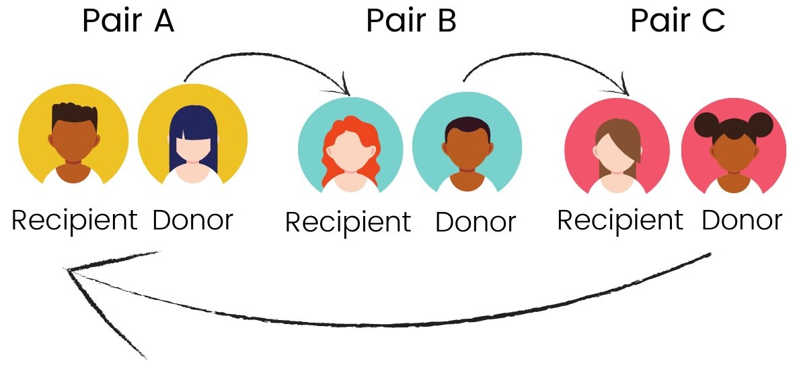{fig-align="center" width=40%}

. . . 

* **Objective:** Optimal arrangement of exchanges (factors in medical urgency, waiting time, compatibility between donor and patient)
<!-- * **Individual rationality:** a donor should only give a kidney if her patient receives one. -->
* Limited cycle / chain length leads to computational challenges.

::: aside
Implemented by the US, UK, Netherlands, Canada, Korea, and many other countries.
:::

::: {.notes}
I mentioned before that some mechanisms cannot use money. Organ donation is an excellent example, because it's illegal to pay for organs in most countries.

Paired Kidney donation scheme are one of my favourite mechanism designs without money. 

In a nutshell, many patients in need of a kidney have a willing donor who is medically incompatible. These patient-donor pairs can join a "market" together with other patient-donor pairs. And these pairs can then exchange kidneys between them.

Here you can see an example with three pairs. The donor of Pair A is compatible with the Patient / recipient of Pair B. The donor of Pair B is compatible with the patient of Pair C, and the donor of pair C is compatible with the patient of pair A.

Paired Kidney donation drastically increases the number of transplants that can be performed each year. KPD schemes have been implemented in several countries, including the US, UK, Netherlands, Canada and Korea.

It's also a beautiful application of mechanism design. The objective of the scheme is to find an optimal arrangement of exchanges. This typically factors medical urgency, waiting times, and compatibilities between patients and donors.

But a key factor in the design is also stability and individual rationality: patient-donor pairs are better off participating in the KPD scheme than if they don't.

In practice the size of donation cycles is typically limited. For example, the UK only allows cycles of 2 and 3, because the transplant operations have to be performed simultaneously. This turns out to make the problem of computing optimal donation cycles very challenging. A lot of theoretical work has gone into algorithms for KPD.
:::

##

::: {}
### National Resident Matching

* Matches 35,000 medical students to residency programs annually.
* Uses *Roth-Peranson matching algorithm* (based on Nobel prize winning work by Gale, Shapley, and Roth).
* It's strategy-proof for the students!
:::

::: {}
### School Choice

* Traditional mechanisms encouraged strategic gaming, harming disadvantaged families.
* Used to assign hundreds of thousands of students to public schools (Boston, NYC, Amsterdam, Barcelona, and more).
* *Student-proposed deferred acceptance algorithm* is also strategy-proof.
:::

<!-- 
::: {.fragment}
#### Course allocation

* Fairly assigning university students to oversubscribed courses is hard.
* Students use artificial currency to bid in a "market for courses".
* Used at many institutions, e.g., Harvard Business School, Wharton, Stanford, and in UK.

:::  -->

::: {.notes}
I want to, very briefly, give two more celebrated examples of mechanisms without money.

Firstly, the National Resident Matching Program in the US matches 35,000 medical students with residencies in hospitals every year. It uses the *deferred acceptance algorithm* proposed by Shapley and Roth, who received a Nobel prize partly for this work. The exchange is incentive-compatible for medical students, and has been extraordinarily successful in fixing the ad-hoc solutions for residencies that existed before.

Secondly, a modification of the deferred acceptance algorithm has been used in many places to allocate hundreds of thousands of students to public schools. Compared to previous mechanisms, which were often gamed by parents, the new mechanism is strategy-proof. This particularly benefits disadvantaged families, who had limited capacity to strategise.
:::

## Computation
Mechanism Design now equally at home in Economics and Computer Science.

::: {.item-container}
- **Auction Theory**
- **Matching Theory**
- **Fair Division**
- **Contract Theory**
- **Voting Systems**
- **Liquid Democracy**
- **Evolutionary Game Theory**
:::

* Mechanisms for real-life problems require (non-trivial) computations!
* Computations might be infeasible. What about approximations?
* How hard is it for agents to be strategic?

::: {.notes}
MD originated as a branch of economics. It's a vast field, covering [...].

Computer science now holds a central place in the discipline. This is partly because mechanisms are only relevant in practice if we can actually compute the outcomes. For example, if it took months to compute a good allocation of kidney pair donations, then an optimal KPD wouldn't be useful. It's often more realistic to look for an approximately optimal solution, which can be easier to compute.

Computational aspects becomes even more important when a mechanism involves many participants and large amounts of data. 

But computer science can also provide other insights. For example, suppose we have a mechanism in which people can be strategic. If it's too complicated for people to find the best way to lie, they might instead be truthful instead. Computer science provides many tools that can help us reason about how hard it is to calculate or compute strategies.
:::

## Solving Society's Pressing Problems

Many problems are highly complex, and have many stakeholders.

* Equitable & efficient healthcare provision
* Environmental protection
* Educational initiatives for disadvantaged communities
* Land allocation to indigenous groups
* Refugee resettlement

:::: {.columns}

::: {.column}

$\ $

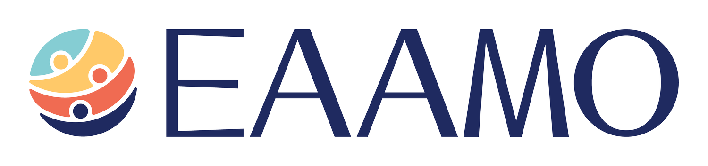{width="80%" fig-align="center"}
:::

::: {.column}
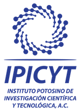{width="28%" fig-align="center"}
:::

::::

<!-- ::: {layout-ncol=2}

::: -->

::: {.notes}

I am very optimistic that mechanism design can help us solve many of society's most pressing problems.

Areas where I see particular immediate potential are in [...].

But these problems are often highly complex, and involve many stakeholders who have different strategic aims and cultural outlooks.

EAAMO, which Francisco told us about earlier today, has been instrumental in connecting research and stakeholders to build solutions for these problems.

I've also had the honour of working closely with IPICYT here in SLP to implement a COVID testing mechanisms, which has been a fantastic experience.

:::

## Challenges in complex settings

In many settings, we hit fundamental theoretical or computational limits.

. . .

**Example: The Vickrey-Clarkes-Groves Auction**

1. Ask each bidder to submit a bid for each bundle of goods.
2. Allocate the goods to maximise welfare.
3. Charge each bidder the *harm they have caused the other agents*

This auction is incentive-compatible!

. . . 

**Now the bad news...**

* Not computationally feasible for many goods and bidders.
* Low revenue.
* Intransparent pricing rule?

::: {.notes}
But there are fundamental challenges in mechanism design that can limit what we can achieve.

I'll give you a famous example from the auction literature: the VCG auction. Suppose we want to run an auction with multiple goods simultaneously, for example multiple auditoriums. The VCG auction asks bidders to submit bids for all bundles of goods, and then allocates the goods to maximise welfare (just like the second-price auction). But instead of asking the bidder to pay their bid or the second-highest bid, the auction charges each bidder the harm that they have caused the other bidders. This is the difference between what the other bidders got and what they could have got if the bidder hadn't participated at all.

The good news is that VCG is IC.

But the bad news is that the pricing rule is complicated / intransparent.

The VCG auction also often leads to low revenue.

And perhaps most importantly, it's not computationally feasible with many bidders and goods.

So VCG isn't used much in practice.
:::

## Theory → Practice

**Many proposals to stakeholders are rejected:**

* mechanisms are too complicated for (non-technical) stakeholders

**Practical mechanism design should prioritise:**

1. **Stakeholder buy-in**: participants understand and accept mechanism
2. **Computational feasibility** of the problem
3. **Ongoing refinement** of system based on feedback

## AI-Enhanced Designs

AI can provide powerful tools to bridge theory and practice.

* **Reinforcement learning** and **neural networks** can make mechanisms more tractable.
* LLMs can allow participants to **communicate in natural language**.

. . . 

#### Pros and Cons

* We lose some mathematical performance guarantees.
* Mechanisms can be applied to much broader domains.
* We can often **fuse classical mechanisms with AI elements**.

::: aside
Meta Fundamental AI Research Diplomacy Team (FAIR) et al., "Human-level play in the game of Diplomacy by combining language models with strategic reasoning", *Science*, 2022.

David Rothschild et al., "The Agentic Economy", ArXiv, 2025.

Michael Tessler et al., "AI can help humans find common ground
in democratic deliberation", Science, 2024. 
:::

::: {.notes}
* The success stories emphasise the need for simplicity or ease of use.
:::

## Combinatorial Auctions {auto-animate=true}

::: {.auction-container .goods .large}
* 🚲
* 🏠
* 🍾
* ⛵️
:::
::: {.auction-container .large}
* 🙋‍♂️
* 💁🏻
* 🧕🏽
:::

Each person has a value for each bundle of goods.

## Combinatorial Auctions {auto-animate=true}

::: {.auction-container .goods .large}
* 🚲
* 🏠
* 🍾
* ⛵️
:::
::: {.auction-container .large}
* 🙋‍♂️
* 💁🏻
* 🧕🏽
:::

::: {.first-box}
:::
::: {.second-box}
:::
::: {.third-box}
:::
Each person has a value for each bundle of goods.

Exponentially many bundles per agent!

## Combinatorial Auctions {auto-animate=true}

::: {.auction-container}
* 🚲
* 🏠
* 🍾
* ⛵️
:::
::: {.auction-container}
* 🙋‍♂️
* 💁🏻
* 🧕🏽
:::

State-of-the-art auctions compute optimal outcomes by repeatedly making "mathematical" queries to the buyers:

* **Demand query**: At these prices for each bundle, which bundle do you want?
* **Value query**: How much do you value this bundle?

⚠️  In the real world, asking these queries is cognitively & logistically costly or impossible.

## LLM-Proxy Auctions

::: {.key-question}
**Insight:** We can use LLMs to communicate with buyers in natural language!
:::

from [David Huang, Francisco Marmolejo-Cossío, EL, David Parkes, "Accelerated Preference Elicitation with LLM-Based Proxies", 2025]

. . .

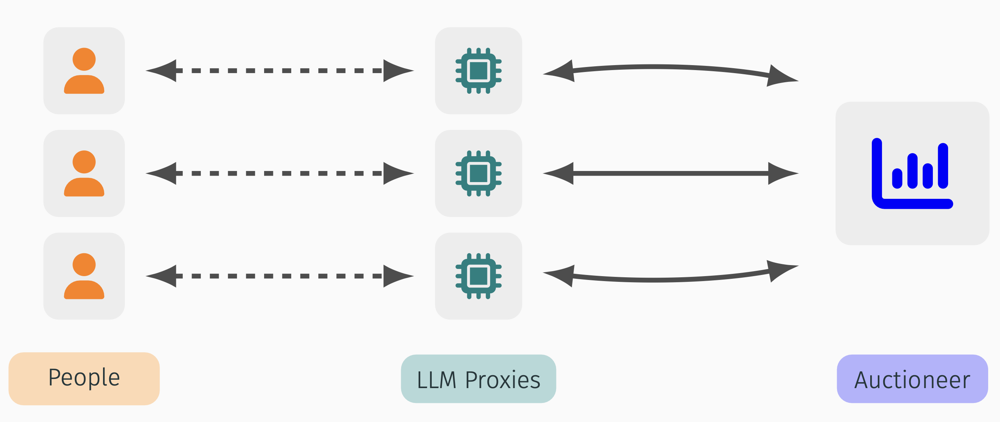{fig-align="center"}

<!-- ::: aside
The auctioneer implements the Competitive Equilibrium Combinatorial Auction (Lahaie and Parkes, 2004).
::: -->

## LLM-Proxy Auctions

:::: {.columns}
::: {.column width="70%"}
* Each proxy maintains a belief of person's preferences.
* Proxies learn from their person through
    - natural language conversation
    - value & demand queries
* Proxies use chat history to **infer values**.
:::
::: {.column width="30%"}
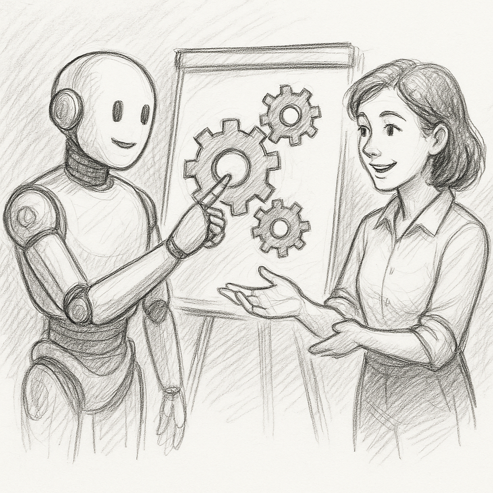{fig-align="center" width="100%"}
:::
::::

<!-- 

**Simulation pipeline for experiments**

* Different LLMs simulate people's responses to natural language questions and value/demand queries.
* LLM's responses are grounded in a **seed description** generated in natural language. -->

## LLM-Proxy Auctions {auto-animate=true}
Experiments with $6$ goods in three contexts.

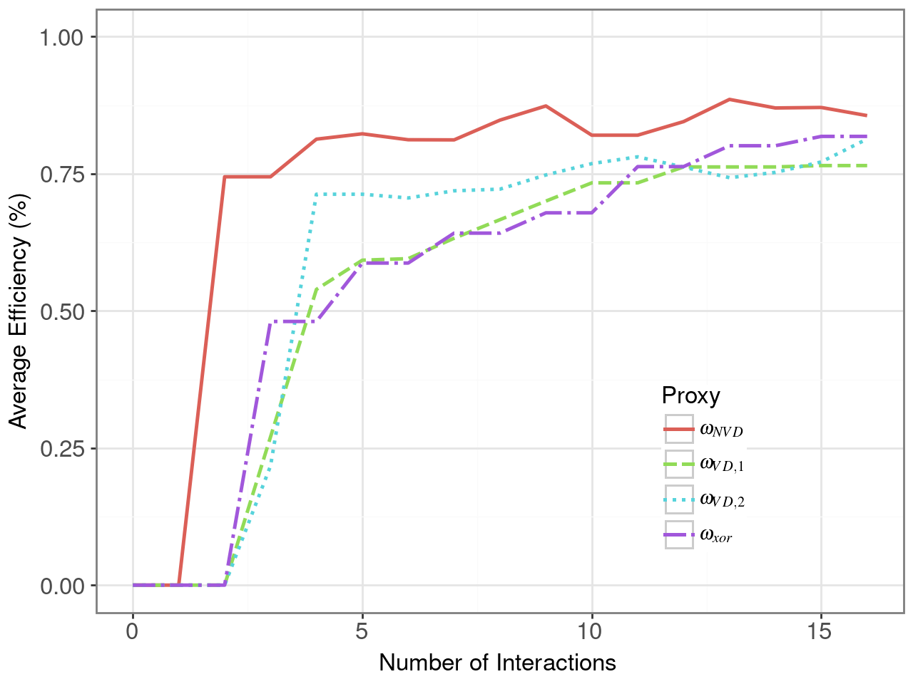{fig-align="center" width="100%"}

**Auction efficiency:** LLM proxies can achieve higher welfare with less proxy--person communication.

**Long-run performance:** Our best proxy better approximates a person's valuation than traditional mechanisms. The auction with LLM proxies converges to maximum welfare.

<!-- ::: {.fragment .fade-in}
**Result 3 (Simulation robustness):** The LLM simulation pipelines behaves similarly with different LLM models.
::: -->

## 🚧 Work in Progress

LLM-Proxy work provides blueprint for augmenting mechanism design with LLMs:

* LLM proxies **mediate** between "mathematical" mechanism and humans.
* Can collate and infer preferences (from different stakeholders).

. . .

####  Vivienda Digna
* SLP is considering a land allocation program for indigenous groups.
* LLMs as a powerful tool to formulate detailed preferences and expectations. 
* Important to **build trust** by allowing stakeholders to audit the decision processes.

:::: {.columns}

::: {.column width="13%"}
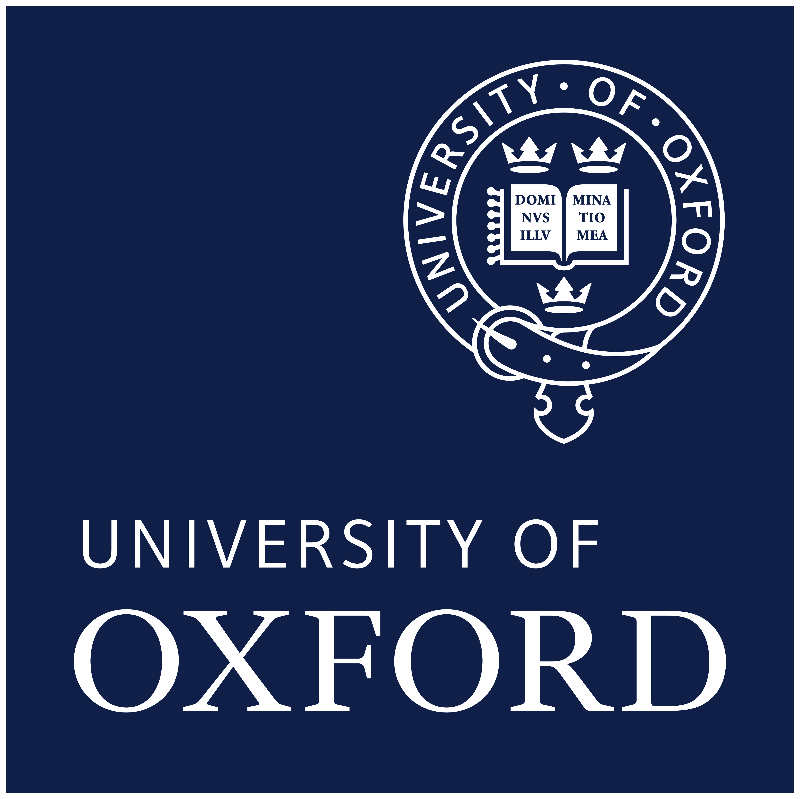{width=90%}
:::

::: {.column width="13%"}
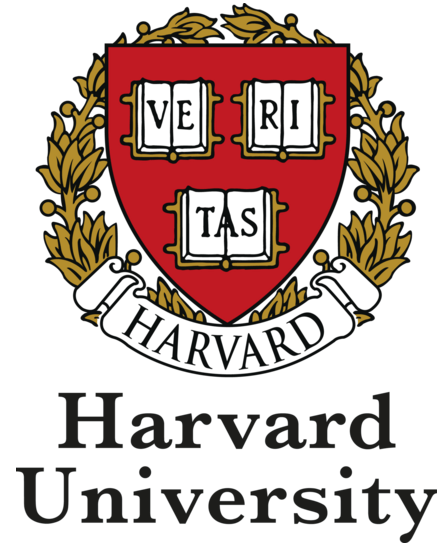{width=90%}
:::

::: {.column width="13%"}
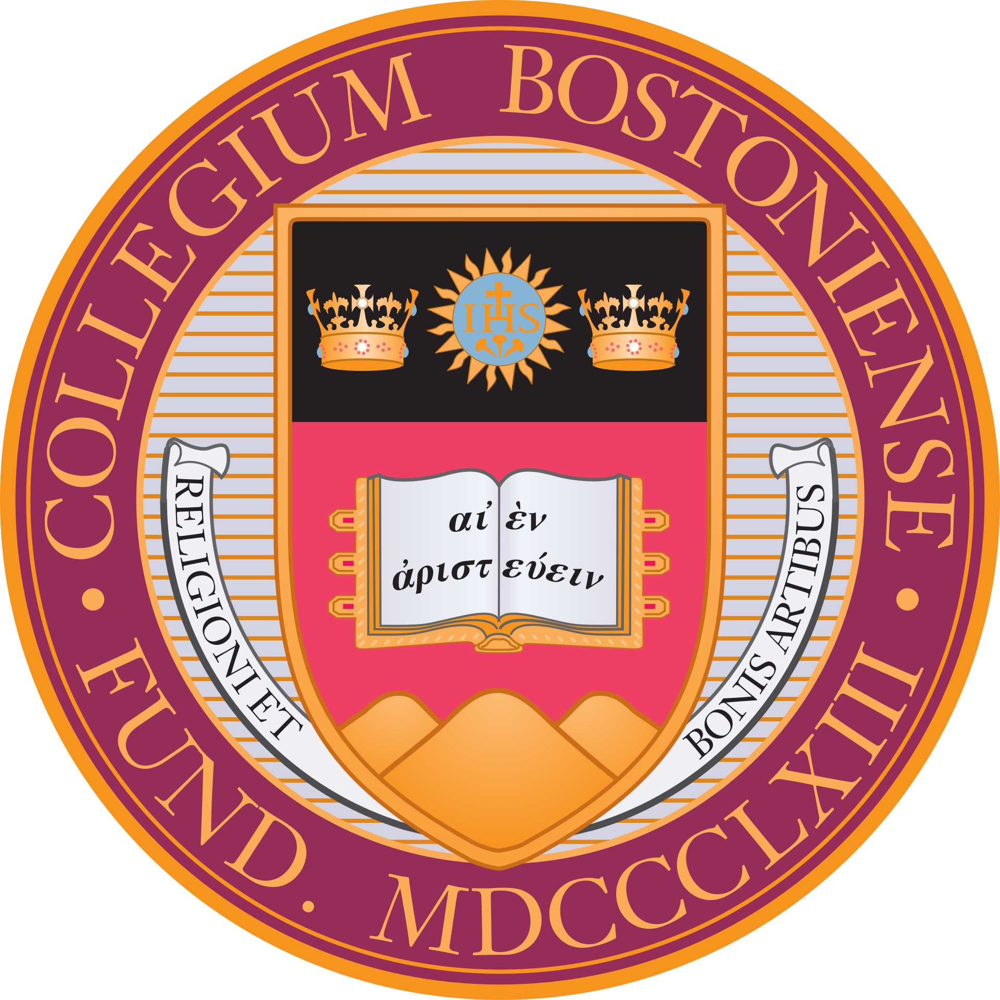{width=90%}
:::

::: {.column width="25%"}
{width=90%}
:::

::: {.column width="34%"}
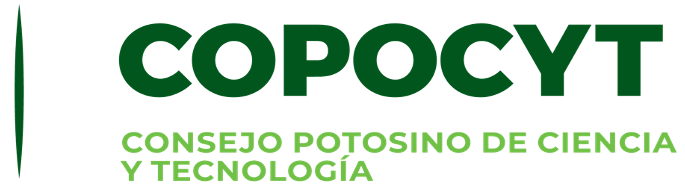{width=100%}
:::

::::

<!-- {width=100%}

{width=100%} -->

## Takeaways

::: {.conclusion-list}
* We can, and should, apply mechanism design to solve some of society's most pressing problems.
* Focusing on simplicity and stakeholder buy-in is key to success.
* Integrating AI like LLMs for natural language communication can result in more human-centric mechanisms to better serve the needs of communities.
:::

Thank you!

Get in touch: [edwin.lock@cs.ox.ac.uk](mailto:edwin.lock@cs.ox.ac.uk)

::: {.notes}

I'd like to you take away points from this talk. Firstly, mechanism design is a fantastic tool in our tool box to solve important problems that we face.

Secondly, the success stories of MD demonstrate that it's not just the theoretical guarantees that matter. The success of a mechanism also depends on its simplicity and stakeholder buy-in, which often requires a lot of fine tuning and incremental improvements.

LLMs are revolutionising how we interact with technology. Integrating AI into mechanism designs can allow us to design truly human-centric mechanisms that can help make real progress.
:::
